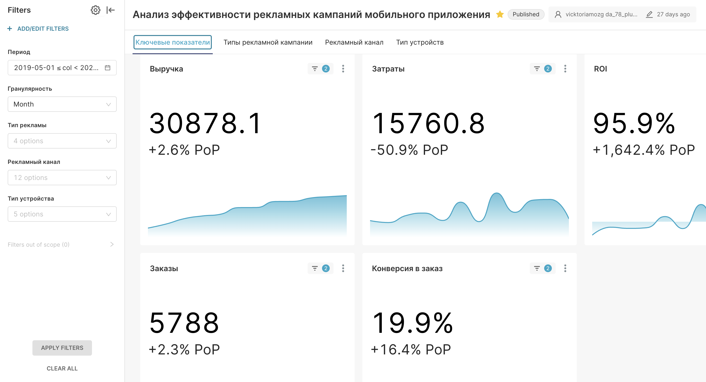
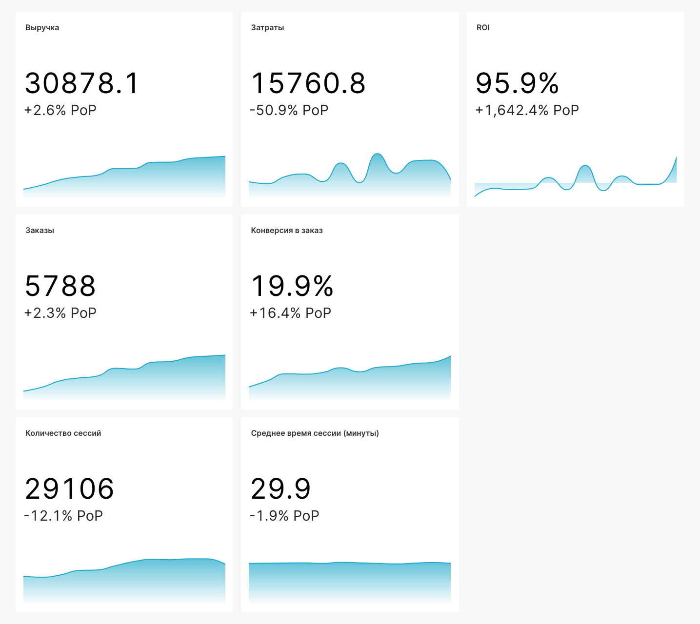
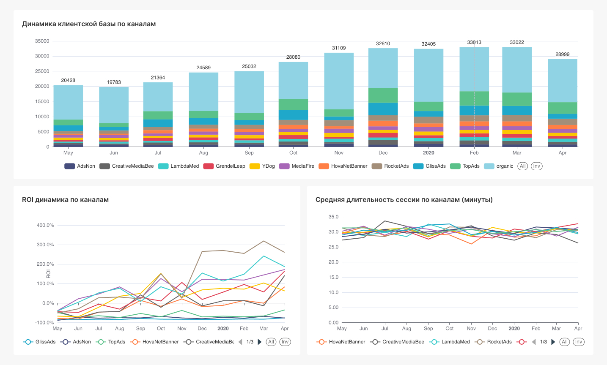
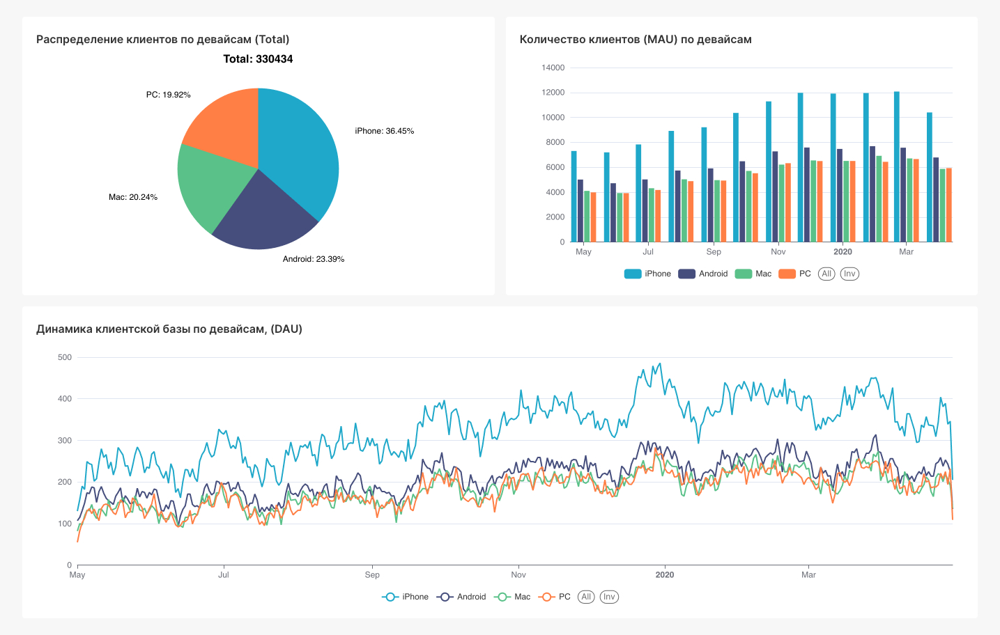

# Advertising Analytics Dashboard

## Project Overview

This project presents an interactive BI dashboard for analyzing the effectiveness of advertising campaigns for a mobile application.

The dashboard helps monitor the full marketing funnel—from advertising costs to revenue and evaluates campaign performance across channels, campaign types, devices, and time periods.

---

## Business Task

Develop an interactive dashboard for business users that allows them to:

- monitor advertising campaign performance;
- evaluate marketing efficiency;
- compare acquisition channels;
- analyze campaign types;
- monitor ROI and conversion;
- support marketing budget planning.

---

## Target Users

- Marketing Managers
- Business Managers
- Executives

---

## Technologies

- SQL
- Apache Superset

---

## Data Sources

The dashboard is based on three datasets:

- Advertising costs
- User sessions
- Orders

The datasets are linked through user identifiers, allowing the entire customer journey to be analyzed—from the first session to the completed purchase.

---

## Dashboard Structure

The dashboard consists of four analytical pages:

1. Key Metrics
2. Campaign Types
3. Advertising Channels
4. Device Types

Interactive filters allow users to analyze the data by:

- Date
- Campaign Type
- Advertising Channel
- Device Type
- Time Granularity

---

## Dashboard Preview

### Dashboard Overview

---

### Key Metrics

---

### Campaign Types

---

### Advertising Channels

---

### Device Types

---

## Key Metrics

The dashboard includes the following business metrics:

- Revenue
- Advertising Cost
- ROI
- Orders
- Conversion Rate
- Average Session Duration

---

## Key Insights

The dashboard enables users to:

- identify the most effective advertising channels;
- compare campaign performance;
- analyze user behavior across device types;
- monitor marketing ROI;
- support advertising budget optimization.

---

## SQL

SQL scripts used to prepare the dashboard data are available in the `sql` folder.
