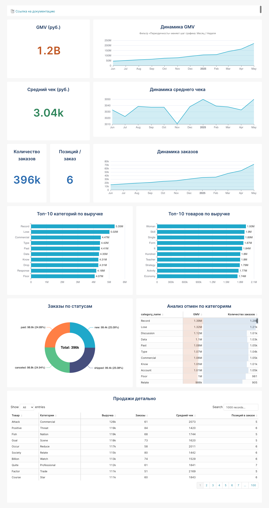
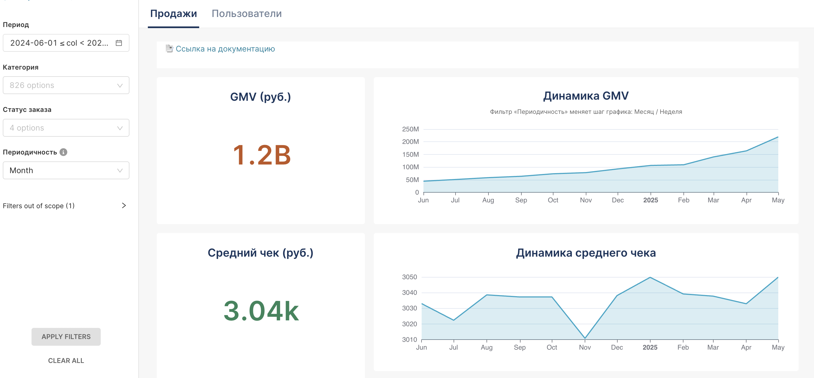
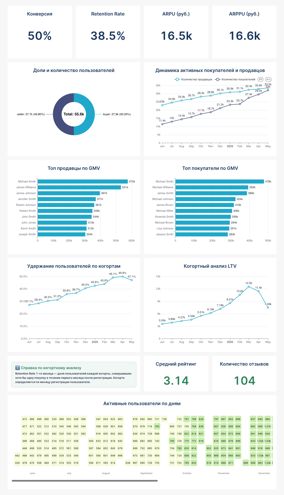

# Sales & User Analytics Dashboard

## Project Overview

An interactive BI dashboard designed to analyze sales performance and user behavior.

The project combines sales and customer analytics into two interconnected dashboard sections, helping track key business metrics, monitor trends, identify top-performing segments, and analyze user retention and lifetime value.

The dashboard provides a structured view of both business performance and customer behavior, supporting data-driven decision-making.

---

## Dashboard

### Sales Analytics

The Sales section provides an overview of key commercial metrics and sales performance over time.

Key metrics include:

- Gross Merchandise Value (GMV)
- Average Order Value
- Number of Orders
- Average Items per Order

The dashboard also includes:

- GMV trends over time
- Average order value dynamics
- Order volume dynamics
- Top categories by revenue
- Top products by revenue
- Order status distribution
- Cancellation analysis by category
- Detailed sales table

### Sales Dashboard



### Sales Dashboard Overview and Filters



---

## User Analytics

The User section focuses on customer and seller behavior, engagement, retention, and value.

Key metrics include:

- Conversion Rate
- Retention Rate
- ARPU
- ARPPU

The dashboard also provides insights into:

- Buyer and seller distribution
- Active buyers and sellers over time
- Top sellers by GMV
- Top buyers by GMV
- Cohort retention analysis
- Customer Lifetime Value (LTV)
- Average rating
- Number of reviews
- Daily active user patterns

### User Analytics Dashboard



---

## Key Business Questions

The dashboard helps answer questions such as:

- How is GMV changing over time?
- Which categories and products generate the highest revenue?
- How do order volume and average order value evolve?
- Which order statuses are most common?
- Which categories have the highest cancellation rates?
- Who are the top buyers and sellers by GMV?
- How are the numbers of active buyers and sellers changing?
- How well are users retained over time?
- How does customer lifetime value change across cohorts?

---

## Filters and Interactivity

The dashboard allows users to analyze data using interactive filters, including:

- Date period
- Category
- Order status
- Time granularity

The time granularity filter allows users to switch between different aggregation levels for trend analysis.

---

## Documentation

Detailed project documentation, including data preparation, metrics, dashboard logic, and analytical approach, is available here:

[**View Project Documentation**](https://docs.google.com/document/d/1kQzNIiv_Q7FOGYoxDBRMefCH3sK8BFvGjqr9KAd9ToY/edit?tab=t.0)

---

## Tools

- Apache Superset
- SQL
- PostgreSQL
- Data Visualization
- Cohort Analysis
- Business Analytics

---

## Project Structure

```text
01_bi_sales_and_user_analytics/
│
├── images/
│   ├── sales_dashboard.jpg
│   ├── sales_dashboard_overview.png
│   └── user_analytics_dashboard.jpg
│
└── README.md
