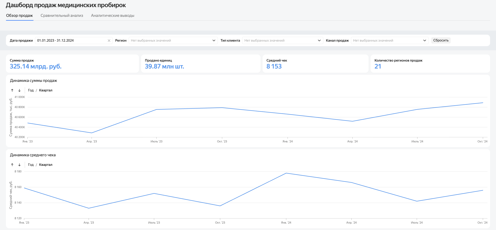
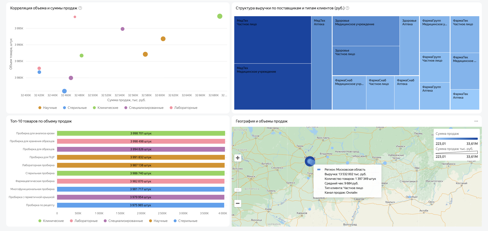
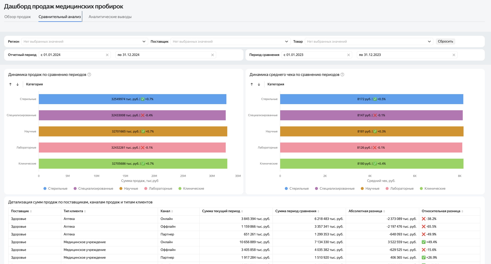

# Medical Tube Sales Dashboard

## Project Overview

This project presents an interactive sales analytics dashboard developed in Yandex DataLens for analyzing the sales performance of medical tubes.

The dashboard provides an overview of key business metrics, sales dynamics, revenue structure, customer segments, sales channels, suppliers, and regional distribution.

The analysis covers the period from 2023 to 2024 and is designed to support business users in monitoring sales performance and identifying key trends and deviations.

---

## Interactive Dashboard

<a href="https://datalens.yandex/n6dizmyks6fq7" target="_blank">Open the interactive dashboard in Yandex DataLens ↗</a>

---

## Business Task

Develop an interactive BI dashboard that allows users to:

- monitor key sales performance indicators;
- analyze sales dynamics over time;
- compare current and previous periods;
- evaluate average order value;
- analyze sales by product category;
- identify the contribution of suppliers and customer segments to total revenue;
- compare sales channels;
- analyze regional sales distribution;
- identify growth areas and negative trends.

---

## Dashboard Structure

The dashboard consists of three main analytical sections:

### 1. Sales Overview

The first section provides a general overview of sales performance.

It includes:

- total sales;
- number of units sold;
- average order value;
- number of sales regions;
- sales dynamics;
- average order value dynamics.

Users can filter the dashboard by:

- sales period;
- region;
- customer type;
- sales channel.

---

### Sales Overview

---

### 2. Revenue Structure and Sales Geography

This section focuses on the structure and distribution of sales.

The analysis includes:

- correlation between sales volume and revenue;
- Top-10 products by sales volume;
- revenue structure by supplier and customer type;
- geographical distribution of sales.

The visualizations help identify the largest contributors to revenue and evaluate the concentration of demand across regions.

---

### Revenue Structure and Sales Geography

---

### 3. Comparative Analysis

The comparative analysis section allows users to compare two periods and identify changes in sales performance.

The analysis includes:

- sales dynamics by product category;
- average order value by category;
- detailed comparison by supplier;
- customer type;
- sales channel;
- absolute and relative differences between periods.

---

### Comparative Analysis

---

## Analytical Findings

The analysis of sales data for 2023–2024 revealed several important trends in sales dynamics, demand structure, and sales channel performance.

### Overall Performance

During the reporting period, the key business indicators were:

- **Total sales:** 325.14 billion RUB
- **Units sold:** 39.87 million
- **Average order value:** 8,153 RUB
- **Sales geography:** 21 regions

Overall sales demonstrated a positive trend.

After a decline at the beginning of the analyzed period, sales recovered and continued to grow, reaching their highest levels by the end of 2024.

The average order value remained relatively stable with only minor fluctuations.

---

### Leading Product Categories

The highest sales volumes during the comparison period were generated by:

| Category | Revenue |
|---|---:|
| **Clinical** | 32.71 billion RUB |
| **Scientific** | 32.70 billion RUB |
| **Sterile** | 32.55 billion RUB |

The **Clinical**, **Scientific**, and **Sterile** categories each demonstrated approximately **0.7% revenue growth** compared with the previous period, indicating stable demand.

---

### Average Order Value Remained Stable

The highest average order values were recorded in the following categories:

| Category | Average Order Value |
|---|---:|
| **Scientific** | 8,181 RUB |
| **Clinical** | 8,180 RUB |
| **Sterile** | 8,172 RUB |

Growth in average order value was observed in:

- **Sterile** — +0.5%
- **Clinical** — +0.4%
- **Scientific** — +0.3%

These results indicate relatively stable pricing and a consistent sales structure.

---

### Online Sales to Individual Customers Showed the Highest Growth

The fastest-growing segments were:

| Supplier | Segment | Growth |
|---|---|---:|
| **MedTech** | Individual / Online | +226.9% |
| **PharmaTech** | Individual / Online | +179.3% |
| **MedTech** | Individual / Partner | +172.5% |
| **Health** | Individual / Online | +145.7% |
| **PharmaTech** | Individual / Partner | +124.9% |

The largest absolute increase was recorded for **MedTech in the Individual / Online segment**, where sales increased by **17.8 billion RUB**.

---

### MedTech Holds Leading Positions in Sales Volume

The revenue structure shows that segments associated with **MedTech** generate the largest share of total sales.

The strongest growth was observed in:

- sales to medical institutions through online channels — **+95.7%**;
- sales to individual customers through online channels — **+226.9%**;
- sales to individual customers through partner channels — **+172.5%**.

This indicates the strong development of online channels and the expansion of the supplier's customer base.

---

### Sales Are Regionally Concentrated

The largest sales volume is concentrated in **Moscow**, confirming a high concentration of demand in the country's largest economic center.

Other regions generate significantly smaller sales volumes.

---

## Risks and Negative Trends

Despite positive overall trends, the analysis identified several areas requiring additional attention.

### Decline in the Pharmacy Segment

The most significant decline in sales was observed for **PharmaGroup** and **PharmaSupply**:

| Supplier | Segment | Change |
|---|---|---:|
| **PharmaGroup** | Pharmacy / Offline | −92.8% |
| **PharmaSupply** | Pharmacy / Offline | −91.0% |
| **PharmaGroup** | Pharmacy / Partner | −89.6% |
| **PharmaSupply** | Pharmacy / Partner | −86.7% |
| **PharmaGroup** | Pharmacy / Online | −86.7% |
| **PharmaSupply** | Pharmacy / Online | −84.7% |

Negative dynamics were also observed in several other pharmacy-related sales channels.

---

### Declining Performance of Individual Suppliers

**PharmaGroup** and **PharmaSupply** demonstrated declining sales across multiple customer types and sales channels, including the medical institution segment.

The largest absolute losses were:

- **PharmaSupply — Pharmacy / Online:** −5.19 billion RUB;
- **PharmaGroup — Medical Institution / Online:** −5.08 billion RUB;
- **PharmaSupply — Medical Institution / Online:** −4.58 billion RUB.

These segments require additional analysis to identify the reasons behind the decline and evaluate the effectiveness of current sales channels.

---

## Business Conclusions

The analysis shows that overall sales performance demonstrates a stable positive trend.

Growth is primarily driven by:

- the development of online sales channels;
- increased sales to individual customers;
- stable demand for Clinical, Scientific, and Sterile product categories;
- strong performance of MedTech.

At the same time, significant risks are associated with declining sales for PharmaGroup and PharmaSupply, particularly in the pharmacy segment.

Further analysis should focus on identifying the reasons for negative sales dynamics and evaluating the effectiveness of the affected sales channels.

---

## Tools

- Yandex DataLens
